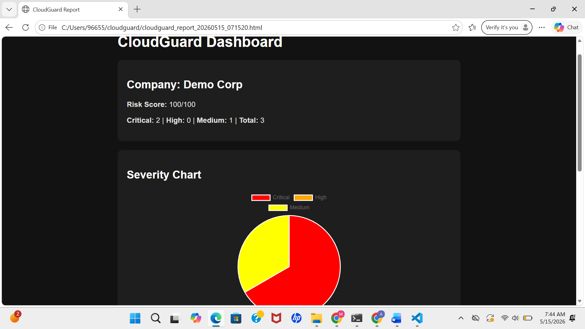
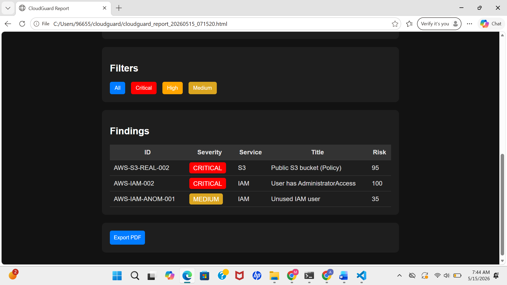

# 🛡️ CloudGuard — Multi-Cloud Security Auditor


> Scans AWS, Azure, and GCP against **CIS Benchmarks v3** and **NIST SP 800-53 Rev 5**.  
> Detects misconfigurations, scores risk 0–100, and generates remediation playbooks.

---

## 📊 Report Dashboard





---

## 🔍 Real Findings on a Live AWS Account

| Finding | Severity | Risk Score |
|---|---|---|
| Public S3 bucket (Policy) | 🔴 CRITICAL | 95 |
| User has AdministratorAccess | 🔴 CRITICAL | 100 |
| Unused IAM user | 🟡 MEDIUM | 35 |

**Overall Risk Score: 100/100 — HIGH RISK**

---

## ✅ Checks Implemented (20+)

| Check ID | Service | What It Detects | CIS Control |
|---|---|---|---|
| AWS-IAM-001 | IAM | Root account active access keys | CIS AWS 1.4 |
| AWS-IAM-002 | IAM | Root MFA disabled | CIS AWS 1.5 |
| AWS-IAM-004 | IAM | Console users without MFA | CIS AWS 1.10 |
| AWS-IAM-006 | IAM | AdministratorAccess on users | CIS AWS 1.14 |
| AWS-S3-001 | S3 | Public access block disabled | CIS AWS 2.1.1 |
| AWS-S3-003 | S3 | Versioning disabled | CIS AWS 2.1.3 |
| AWS-S3-005 | S3 | Default encryption disabled | CIS AWS 2.1.1 |
| AWS-EC2-001 | EC2 | SSH open to 0.0.0.0/0 | CIS AWS 5.2 |
| AWS-EC2-002 | EC2 | RDP open to 0.0.0.0/0 | CIS AWS 5.3 |
| AWS-EC2-004 | VPC | Flow logs disabled | CIS AWS 4.1 |
| AWS-EC2-005 | EBS | Volumes unencrypted | CIS AWS 2.2.1 |
| AWS-CT-001 | CloudTrail | Not multi-region | CIS AWS 3.1 |
| AZ-STG-001 | Azure Storage | HTTP allowed | CIS Azure 3.1 |
| AZ-IAM-001 | Azure RBAC | Owner at subscription scope | CIS Azure 1.1 |
| AZ-NET-001 | Azure NSG | SSH open from internet | CIS Azure 6.1 |
| GCP-STG-001 | Cloud Storage | Bucket publicly accessible | CIS GCP 5.1 |
| GCP-IAM-002 | GCP IAM | Service account with Owner role | CIS GCP 1.5 |

---

## 🚀 Quick Start

```bash
git clone https://github.com/suhaib1202/cloudguard.git
cd cloudguard

python -m venv venv
venv\Scripts\activate        # Windows
source venv/bin/activate     # Mac/Linux

pip install -e .
cp .env.example .env         # Add your credentials
cloudguard quickcheck        # Verify connectivity
cloudguard scan              # Run full scan
```

---

## 🏗️ Architecture

```
cloudguard/
├── engine/
│   ├── finding.py             # Provider-agnostic Finding dataclass
│   ├── risk_scorer.py         # CVSS-inspired 0-100 risk scoring
│   └── compliance_mapper.py   # CIS + NIST 800-53 control mappings
├── scanner/
│   ├── aws/
│   │   └── checks/            # S3, IAM, EC2, CloudTrail checks
│   ├── azure/                 # Storage, RBAC, NSG checks
│   └── gcp/                   # Cloud Storage, IAM, Compute checks
└── reporter/
    └── html_reporter.py       # Risk-scored HTML + JSON export
```

---

## 🛠️ Tech Stack

`Python 3.11` · `boto3` · `azure-sdk` · `google-cloud` · `Jinja2` · `Click` · `Rich`

---

## 💡 Why This Matters

Cloud misconfiguration is the **#1 cause of data breaches** — not exploits.

- **Capital One** breach → overprivileged IAM role
- **Toyota** data leak → public GCS bucket
- **Microsoft Power Apps** → misconfigured storage (38M records exposed)
